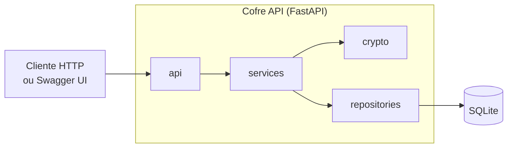

# 🔐 Cofre

> Gerenciador de senhas multiusuário exposto como API REST, desenvolvido com **Specification-Driven Development (SDD)** usando GitHub Spec Kit e Claude Code.

**Status:** Incremento 0 concluído ([v0.1.0](https://github.com/GuidaGaita/bootcamp/releases/tag/v0.1.0)) · ainda sem código de aplicação · próximo: incremento 1, Fundação · [roadmap](docs/09-roadmap.md)

## Sumário

- [Visão geral](#visão-geral)
- [Funcionalidades](#funcionalidades)
- [Arquitetura](#arquitetura)
- [Stack](#stack)
- [Estrutura do repositório](#estrutura-do-repositório)
- [Instalação e execução](#instalação-e-execução)
- [Desenvolvimento com SDD](#desenvolvimento-com-sdd)
- [Governança](#governança)
- [Testes e evidências](#testes-e-evidências)
- [Decisões arquiteturais (ADRs)](#decisões-arquiteturais-adrs)
- [Documentação](#documentação)
- [Créditos](#créditos)

## Visão geral

Pessoas reutilizam senhas, escolhem senhas fracas e guardam credenciais em planilhas e notas. O **Cofre** oferece a cada usuário um **cofre pessoal cifrado**, protegido por uma **senha mestra**:

- todos os dados das credenciais ficam **cifrados em repouso** (AES-256-GCM), com uma chave que só é liberada com a senha mestra do dono;
- um vazamento do banco de dados, sozinho, **não expõe** nenhuma credencial;
- o sistema **gera senhas fortes** e **avalia a força** de senhas existentes.

Detalhes em [docs/01-visao-geral.md](docs/01-visao-geral.md).

## Funcionalidades

| Funcionalidade | Requisitos | Prioridade | Status |
|----------------|------------|------------|--------|
| Verificação de saúde da API | RF-01 | Must | Planejado |
| Cadastro, login e logout com sessão de 30 min | RF-02, RF-03, RF-04 | Must | Planejado |
| Consulta de conta e alteração de senha mestra | RF-05, RF-06 | Should | Planejado |
| Exclusão de conta | RF-07 | Could | Planejado |
| CRUD de credenciais cifradas, com listagem paginada | RF-08, RF-09, RF-11 a RF-13 | Must | Planejado |
| Busca de credenciais | RF-10 | Should | Planejado |
| Gerador de senhas | RF-14 | Must | Planejado |
| Avaliador de força de senha | RF-15 | Should | Planejado |
| Relatório de saúde do cofre (senhas fracas e reutilizadas) | RF-16 | Could | Planejado |

Catálogo completo de requisitos funcionais, não funcionais e regras de negócio: [docs/02-requisitos.md](docs/02-requisitos.md).

## Arquitetura



- **Monólito modular em camadas**; cada camada é testável isoladamente ([docs/03-arquitetura.md](docs/03-arquitetura.md)).
- **Criptografia em envelope:** uma chave de dados por usuário (DEK), protegida por uma chave derivada da senha mestra com Argon2id ([docs/04-seguranca.md](docs/04-seguranca.md)).
- **Sessões com token opaco** revogável; o banco guarda apenas o hash do token.

## Stack

| Área | Tecnologia |
|------|------------|
| Linguagem | Python 3.13 |
| API | FastAPI, Pydantic v2, Uvicorn |
| Persistência | SQLAlchemy 2 + SQLite |
| Criptografia | `cryptography` (AES-256-GCM, HKDF), `argon2-cffi` (Argon2id) |
| Dependências | uv (`pyproject.toml` + `uv.lock`) |
| Qualidade | pytest, pytest-cov, ruff |
| Ambiente | Docker, Docker Compose, GitHub Actions |
| SDD e IA | GitHub Spec Kit 1.0.6, Claude Code |

## Estrutura do repositório

```text
.
├── CLAUDE.md                     # instruções do agente de IA (Claude Code)
├── README.md
├── .claude/skills/               # skills: speckit-* (Spec Kit), grill-me e grilling
├── .specify/                     # Spec Kit: constituição, templates e scripts
├── .github/                      # templates de pull request e de issues
├── docs/
│   ├── 01-visao-geral.md … 09-roadmap.md
│   ├── adr/                      # decisões arquiteturais
│   ├── relatorios/               # evidências de execução dos testes
│   ├── sessoes/                  # resumos de sessões com o agente
│   ├── glossario.md
│   └── registro-de-refinamentos.md
├── specs/                        # (incremento 1+) uma spec por unidade
├── src/cofre/                    # (incremento 1+) código da aplicação
└── tests/                        # (incremento 1+) harness e suíte de testes
```

## Instalação e execução

### Pré-requisitos

Git · Docker com Compose v2 · Python 3.13 e [uv](https://docs.astral.sh/uv/) (opcional, para rodar sem Docker) · [GitHub CLI](https://cli.github.com/) · [Claude Code](https://docs.anthropic.com/en/docs/claude-code/setup) · Specify CLI 1.0.6. Detalhes em [docs/08-ambiente-e-agentes.md](docs/08-ambiente-e-agentes.md).

### Obter o projeto

```bash
git clone https://github.com/GuidaGaita/bootcamp.git
cd bootcamp
git switch develop
```

### Executar a API e os testes

> Disponível a partir do incremento 1 (unidade 001 — Fundação da API).

```bash
# Com Docker (recomendado)
docker compose up --build          # API em http://localhost:8000 · Swagger em http://localhost:8000/docs
docker compose run --rm tests      # suíte completa; relatórios em ./reports

# Sem Docker
uv sync
uv run uvicorn cofre.main:create_app --factory --reload
uv run pytest
```

### Preparar o fluxo SDD com o agente

```bash
pip install uv
uv tool install specify-cli --from git+https://github.com/github/spec-kit.git@v1.0.6
claude                             # abre o Claude Code na raiz do repositório
```

Os artefatos do Spec Kit (`.specify/`) e as skills (`.claude/skills/`) já estão versionados; não é preciso rodar `specify init` novamente.

## Desenvolvimento com SDD

A especificação é a fonte da verdade. Cada **unidade** do roadmap passa por duas fases, cada uma com seu PR:

1. **Especificação** (`spec/NNN-slug`): `/speckit-specify` → `/speckit-clarify` → `/speckit-plan` → `/speckit-tasks` → `/speckit-analyze` → PR revisado.
2. **Implementação** (`feature/NNN-slug`): `/speckit-implement` com testes primeiro → `/speckit-converge` → relatório de testes → PR revisado.

Mudanças descobertas por testes ou revisões voltam **primeiro para a spec** e ficam registradas no histórico de revisões da spec e em [docs/registro-de-refinamentos.md](docs/registro-de-refinamentos.md).

Processo completo: [docs/05-processo-sdd.md](docs/05-processo-sdd.md) · Princípios: [constituição](.specify/memory/constitution.md) · Regras do agente: [CLAUDE.md](CLAUDE.md).

## Governança

- **Branches:** `main` (releases) ← `develop` (integração) ← `spec/*`, `feature/*`, `fix/*`, `docs/*`, `chore/*`. Nenhum commit direto em `main` ou `develop`.
- **Commits:** Conventional Commits, com descrição em pt-BR.
- **Pull requests:** template com checklist e rastreabilidade; merge commit após a revisão.
- **Revisão:** projeto individual, então cada PR recebe autorrevisão e revisão assistida por IA publicada como comentários, e todos os comentários são tratados antes do merge ([ADR-0012](docs/adr/0012-revisao-de-codigo-em-projeto-individual.md)).
- **Planejamento:** GitHub Issues (templates Unidade, Tarefa, Bug, Mudança de especificação) e GitHub Projects, com milestones por incremento.

Detalhes em [docs/06-governanca.md](docs/06-governanca.md).

## Testes e evidências

- **Níveis:** unitário, integração, API/contrato, segurança e fumaça, com marcadores `pytest` ([docs/07-estrategia-de-testes.md](docs/07-estrategia-de-testes.md)).
- **Rastreabilidade:** cada teste de aceitação declara `@pytest.mark.req("RF-xx")`, e o harness gera o mapa requisito → testes.
- **Gate:** cobertura ≥ 85% e `ruff` limpo no CI.
- **Casos de borda:** catálogo inicial por unidade, incluindo testes que verificam que nada fica em claro no banco e que nenhum segredo aparece nos logs.

### Evidências de execução

Nenhuma execução registrada ainda: o harness de testes é entregue no incremento 1. Os relatórios serão publicados em [docs/relatorios/](docs/relatorios/README.md), e esta seção passará a apontar para o mais recente.

## Decisões arquiteturais (ADRs)

| ADR | Decisão | Status |
|-----|---------|--------|
| [0001](docs/adr/0001-registrar-decisoes-com-adrs.md) | Registrar decisões arquiteturais em ADRs no formato MADR simplificado | Aceita |
| [0002](docs/adr/0002-idioma-da-documentacao-e-do-codigo.md) | Documentação em pt-BR; identificadores de código em inglês | Aceita |
| [0003](docs/adr/0003-claude-code-como-agente-unico.md) | Claude Code como único agente de IA, orientado por `CLAUDE.md` | Aceita |
| [0004](docs/adr/0004-sdd-com-github-spec-kit.md) | SDD com GitHub Spec Kit 1.0.6 (skills do Claude, scripts Python, sem extensão git) | Aceita |
| [0005](docs/adr/0005-api-rest-multiusuario-sem-frontend.md) | Produto como API REST multiusuário, sem frontend no MVP | Aceita |
| [0006](docs/adr/0006-python-fastapi-uv.md) | Python 3.13 + FastAPI, com dependências gerenciadas por uv | Aceita |
| [0007](docs/adr/0007-sqlite-com-sqlalchemy.md) | Persistência em SQLite via SQLAlchemy 2 | Aceita |
| [0008](docs/adr/0008-criptografia-em-envelope.md) | Criptografia em envelope: Argon2id + AES-256-GCM com DEK por usuário | Aceita |
| [0009](docs/adr/0009-sessoes-com-token-opaco.md) | Sessões com token opaco armazenado como hash, em vez de JWT | Aceita |
| [0010](docs/adr/0010-cifrar-todos-os-campos-da-credencial.md) | Cifrar todos os campos da credencial; busca e ordenação em memória | Aceita |
| [0011](docs/adr/0011-fluxo-git.md) | Fluxo Git `main`/`develop` + branches de trabalho, Conventional Commits, merge commit | Aceita |
| [0012](docs/adr/0012-revisao-de-codigo-em-projeto-individual.md) | Revisão de código assistida por IA em projeto individual | Aceita |
| [0013](docs/adr/0013-harness-de-testes-com-pytest.md) | Harness com pytest, marcador de rastreabilidade e gate de cobertura | Aceita |
| [0014](docs/adr/0014-ambiente-reprodutivel-com-docker.md) | Ambiente reprodutível com Docker Compose e CI no GitHub Actions | Aceita |
| [0015](docs/adr/0015-borda-http-com-middleware-asgi-unico.md) | Borda HTTP num middleware ASGI único: `X-Request-ID`, cabeçalhos, log JSON e erro 500 padronizado | Aceita |
| [0016](docs/adr/0016-testes-de-contrato-contra-openapi-da-spec.md) | Testes de API validam respostas contra o `contracts/openapi.yaml` da spec | Aceita |

## Documentação

| Documento | Conteúdo |
|-----------|----------|
| [docs/README.md](docs/README.md) | Índice da documentação |
| [01 — Visão geral](docs/01-visao-geral.md) | Problema, objetivos, escopo e critérios de sucesso |
| [02 — Requisitos](docs/02-requisitos.md) | RF, RNF, regras de negócio e matriz de rastreabilidade |
| [03 — Arquitetura](docs/03-arquitetura.md) | Componentes, modelo de dados, fluxos e visão geral da API |
| [04 — Segurança](docs/04-seguranca.md) | Modelo de ameaças e arquitetura criptográfica |
| [05 — Processo SDD](docs/05-processo-sdd.md) | Fluxo com Spec Kit, refinamento e rastreabilidade |
| [06 — Governança](docs/06-governanca.md) | Branches, commits, PRs, revisão, issues e releases |
| [07 — Testes](docs/07-estrategia-de-testes.md) | Harness, níveis, casos de borda e evidências |
| [08 — Ambiente e agentes](docs/08-ambiente-e-agentes.md) | Ambiente reprodutível e configuração do Claude Code |
| [09 — Roadmap](docs/09-roadmap.md) | Incrementos e decomposição em unidades |

## Créditos

- [GitHub Spec Kit](https://github.com/github/spec-kit) (MIT): fluxo e templates de SDD.
- [mattpocock/skills](https://github.com/mattpocock/skills) (MIT): skills `grill-me` e `grilling`.
- Desenvolvido com apoio do [Claude Code](https://docs.anthropic.com/en/docs/claude-code/setup).
