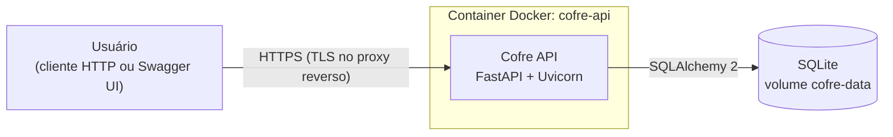
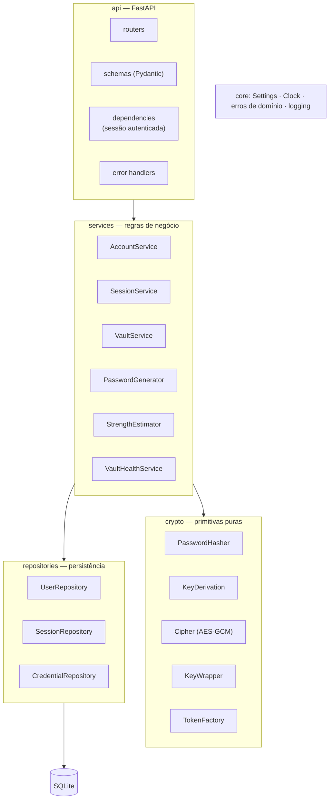
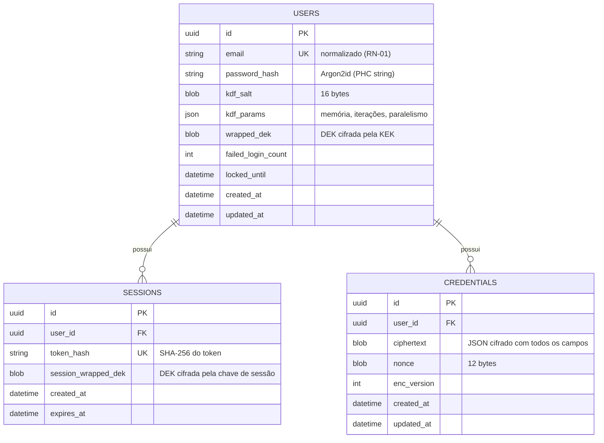
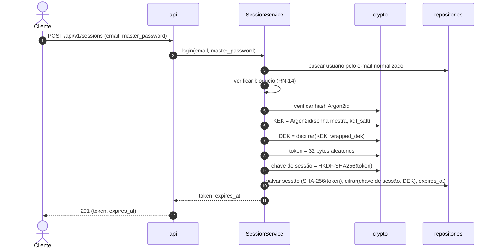
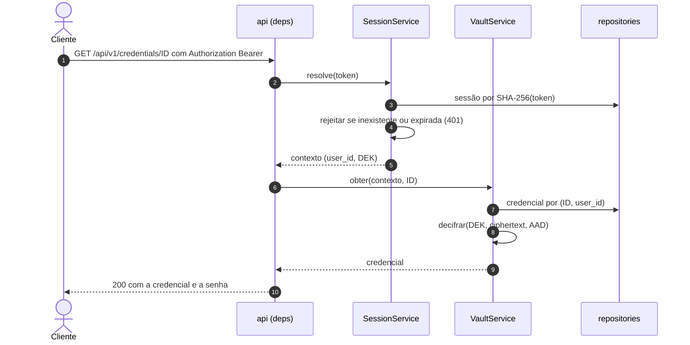

# 03 — Arquitetura

> **Status:** Aprovado · **Versão:** 1.0.0 · **Última revisão:** 2026-09-13
> Descreve a arquitetura-alvo. O detalhamento de cada unidade (modelo de dados, contratos, pesquisa técnica) é produzido por `/speckit-plan` em `specs/NNN-*/`.

## 1. Visão de contexto



- **Uma aplicação, um processo, um banco.** Sem filas, caches externos ou serviços adicionais ([ADR-0005](adr/0005-api-rest-multiusuario-sem-frontend.md), [ADR-0007](adr/0007-sqlite-com-sqlalchemy.md)).
- A interface de uso no MVP é a **Swagger UI** gerada automaticamente em `/docs`.

## 2. Estilo arquitetural

**Monólito modular em camadas**, organizado para que cada componente seja testável isoladamente:



### 2.1 Responsabilidades

| Camada | Responsabilidade | Não pode |
|--------|------------------|----------|
| `api` | HTTP: rotas, validação de entrada/saída (Pydantic), autenticação via dependência, tradução de erros de domínio para HTTP. | Conter regra de negócio ou acessar o banco diretamente. |
| `services` | Regras de negócio (RN-xx), orquestração de criptografia e persistência, transações. | Importar FastAPI ou conhecer HTTP. |
| `crypto` | Hash, KDF, cifragem autenticada, embrulho de chaves, geração de tokens. Funções puras e deterministas dado o input (exceto aleatoriedade injetável). | Fazer I/O ou depender de outras camadas. |
| `repositories` | Modelos SQLAlchemy e acesso a dados; **toda consulta de recurso de usuário filtra por `user_id`**. | Conhecer regras de negócio ou criptografia. |
| `core` | Configuração (`pydantic-settings`, prefixo `COFRE_`), relógio injetável, hierarquia de erros de domínio, logging. | Depender das demais camadas. |

### 2.2 Regra de dependência

`api → services → (crypto, repositories) → core`. Dependências apontam sempre "para dentro"; nenhuma camada importa uma camada acima dela. Isso permite:

- testar `crypto` e `services` sem HTTP e sem banco (com *fakes* de repositório);
- testar `repositories` com SQLite temporário;
- testar `api` ponta a ponta com `TestClient`.

### 2.3 Estrutura de diretórios planejada

```text
src/cofre/
├── main.py                 # create_app(): monta a aplicação FastAPI
├── core/                   # config.py, clock.py, errors.py, logging.py
├── api/
│   ├── routers/            # health.py, accounts.py, sessions.py, credentials.py, passwords.py, vault.py
│   ├── schemas/            # modelos Pydantic de entrada/saída
│   ├── deps.py             # get_settings, get_db, get_current_session
│   └── errors.py           # handlers → formato de erro padronizado
├── services/               # accounts.py, sessions.py, vault.py, passwords.py, health_report.py
├── crypto/                 # hashing.py, kdf.py, cipher.py, keys.py, tokens.py
└── repositories/           # database.py, models.py, users.py, sessions.py, credentials.py
tests/
├── conftest.py             # fixtures do harness (ver 07-estrategia-de-testes.md)
├── unit/  integration/  api/  security/
```

## 3. Modelo de dados conceitual



- **Nenhum campo de credencial fica em claro** — nem título nem URL ([ADR-0010](adr/0010-cifrar-todos-os-campos-da-credencial.md)). Listagem, ordenação e busca acontecem **em memória**, após decifrar o cofre do usuário (limitado a 1.000 itens, RN-07).
- Datas em UTC. IDs são UUID v4.
- Exclusões de usuário removem sessões e credenciais em cascata (RN-12).

## 4. Fluxos principais

### 4.1 Autenticação (login)



### 4.2 Requisição autenticada



Os fluxos de cadastro, alteração de senha mestra e exclusão estão descritos em [04-seguranca.md](04-seguranca.md#4-ciclo-de-vida-das-chaves).

## 5. Aspectos transversais

| Aspecto | Decisão |
|---------|---------|
| Configuração | Variáveis de ambiente com prefixo `COFRE_` via `pydantic-settings` (lista em [08-ambiente-e-agentes.md](08-ambiente-e-agentes.md#3-variáveis-de-ambiente)). |
| Tempo | `Clock` injetável em `core` — permite testar expiração de sessão e bloqueio sem `sleep`. |
| Aleatoriedade | Fonte injetável baseada em `secrets`, substituível apenas em testes unitários do gerador. |
| Transações | Uma sessão de banco por requisição; o *service* confirma ou desfaz a unidade de trabalho. |
| Erros | Services lançam erros de domínio (`NotFoundError`, `InvalidCredentialsError`...); a camada `api` os traduz para HTTP. |
| Logs | Estruturados, com `X-Request-ID`; nunca registram corpo de requisição ou resposta (RNF-04, RNF-13). |
| Migrações | `metadata.create_all` no MVP; Alembic quando houver a primeira mudança de schema pós-release. |

## 6. Visão geral da API

Contratos completos (schemas, exemplos, casos de erro) ficam em `specs/NNN-*/contracts/` e na especificação OpenAPI publicada pela aplicação.

### 6.1 Endpoints

| Método | Rota | Autenticação | Requisito | Sucesso |
|--------|------|:------------:|-----------|---------|
| GET | `/health` | — | RF-01 | 200 |
| POST | `/api/v1/accounts` | — | RF-02 | 201 |
| POST | `/api/v1/sessions` | — | RF-03 | 201 |
| DELETE | `/api/v1/sessions/current` | Bearer | RF-04 | 204 |
| GET | `/api/v1/accounts/me` | Bearer | RF-05 | 200 |
| PUT | `/api/v1/accounts/me/master-password` | Bearer | RF-06 | 204 |
| POST | `/api/v1/accounts/me/deletion` | Bearer | RF-07 | 204 |
| POST | `/api/v1/credentials` | Bearer | RF-08 | 201 |
| GET | `/api/v1/credentials?q=&limit=&offset=` | Bearer | RF-09, RF-10 | 200 |
| GET | `/api/v1/credentials/{id}` | Bearer | RF-11 | 200 |
| PATCH | `/api/v1/credentials/{id}` | Bearer | RF-12 | 200 |
| DELETE | `/api/v1/credentials/{id}` | Bearer | RF-13 | 204 |
| POST | `/api/v1/passwords/generate` | — | RF-14 | 200 |
| POST | `/api/v1/passwords/strength` | — | RF-15 | 200 |
| GET | `/api/v1/vault/health-report` | Bearer | RF-16 | 200 |

> A exclusão de conta usa `POST .../deletion` porque exige a senha mestra no corpo, e corpo em `DELETE` é mal suportado por clientes e proxies.

### 6.2 Convenções

- JSON UTF-8; campos em `snake_case`; datas ISO 8601 em UTC (`2026-09-13T21:00:00Z`).
- Autenticação: `Authorization: Bearer <token>`.
- Respostas paginadas: `{"items": [...], "total": 42, "limit": 20, "offset": 0}`.
- Todas as respostas de `/api/v1` levam `Cache-Control: no-store`.
- Toda resposta leva `X-Request-ID` (gerado ou propagado).

### 6.3 Formato de erro padronizado

```json
{
  "error": {
    "code": "VALIDATION_ERROR",
    "message": "Os dados enviados são inválidos.",
    "details": [
      { "field": "title", "issue": "Campo obrigatório." }
    ]
  }
}
```

| HTTP | `code` | Quando |
|------|--------|--------|
| 401 | `UNAUTHENTICATED` | Token ausente, malformado, expirado ou revogado. |
| 401 | `INVALID_CREDENTIALS` | E-mail/senha mestra incorretos no login, ou senha mestra atual incorreta em operações que a exigem. |
| 404 | `NOT_FOUND` | Recurso inexistente **ou pertencente a outro usuário** (RNF-03). |
| 409 | `EMAIL_ALREADY_REGISTERED` | Cadastro com e-mail já existente. |
| 409 | `VAULT_LIMIT_REACHED` | Limite de 1.000 credenciais atingido (RN-07). |
| 422 | `VALIDATION_ERROR` | Entrada inválida, incluindo JSON malformado e violações de RN-02, RN-06, RN-10 e RN-13. |
| 429 | `TOO_MANY_ATTEMPTS` | Login bloqueado (RN-14); inclui o cabeçalho `Retry-After`. |
| 500 | `INTERNAL_ERROR` | Erro inesperado; nunca expõe detalhes internos. |
