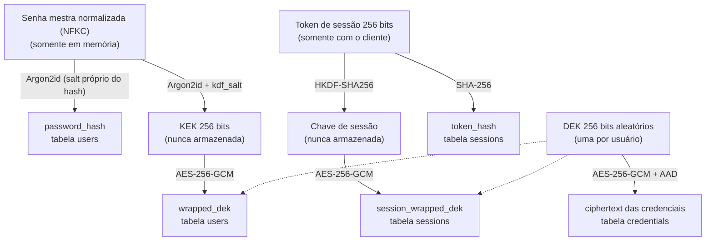

# 04 — Segurança e Modelo de Ameaças

> **Status:** Aprovado · **Versão:** 1.1.0 · **Última revisão:** 2026-09-13
> Este documento é **normativo**: specs, planos e código não podem contradizê-lo sem antes alterá-lo (com ADR, quando a mudança for arquitetural).

## 1. Ativos protegidos

| Ativo | Sensibilidade | Onde existe |
|-------|---------------|-------------|
| Dados das credenciais (senha, usuário, URL, título, notas) | Crítica | Cifrados no banco; em claro apenas em memória durante a requisição e na resposta de RF-11. |
| Senha mestra | Crítica | Apenas em memória, durante cadastro, login, alteração de senha e exclusão de conta. Nunca persistida. |
| DEK (chave de dados do usuário) | Crítica | Cifrada no banco (pela KEK e pela chave de sessão); em claro apenas em memória. |
| Token de sessão | Alta | Com o cliente; no servidor apenas o hash SHA-256. |
| E-mail do usuário | Média | Em claro no banco (necessário para login). |
| Hash de e-mails que tentaram login | Baixa | SHA-256 do e-mail normalizado em `login_throttles`, inclusive de e-mails não cadastrados. |

## 2. Modelo de ameaças

| ID | Ameaça | Cenário | Mitigação | Requisitos |
|----|--------|---------|-----------|------------|
| A1 | Vazamento do banco | Atacante obtém cópia do arquivo SQLite. | Todos os campos de credencial cifrados; DEK só pode ser liberada com a senha mestra (via Argon2id, caro para força bruta offline) ou com um token de sessão válido, que não está no banco. | RNF-01, RNF-02, RNF-06 |
| A2 | Força bruta online no login | Tentativas repetidas de login. | Bloqueio após 5 falhas por 15 min, controlado por e-mail na tabela `login_throttles`; custo do Argon2id por tentativa. | RNF-07, RN-14 |
| A3 | Enumeração de contas pelo login | Descobrir e-mails cadastrados pela resposta, pelo tempo ou pelo bloqueio do login. | Mensagem genérica; quando o e-mail não existe, executa-se uma verificação Argon2id contra um hash fictício para igualar o tempo de resposta; o bloqueio (RN-14) é contado e aplicado igualmente a e-mails cadastrados e inexistentes. | RN-04, RN-14 |
| A4 | Acesso indevido (IDOR) | Usuário troca o ID da credencial na URL. | Toda consulta filtra por `user_id` da sessão; recurso alheio retorna 404; a AAD da cifragem inclui o `user_id`. | RNF-03 |
| A5 | Roubo de token | Token interceptado ou vazado no cliente. | Expiração absoluta de 30 min; logout; revogação de todas as sessões ao alterar a senha mestra; TLS no proxy reverso. | RNF-06, RN-05 |
| A6 | Adulteração de dados cifrados | Alterar ou trocar `ciphertext` entre linhas do banco. | AES-GCM (cifragem autenticada) com AAD vinculada ao usuário e ao ID da credencial: qualquer troca ou alteração falha na decifragem. | RNF-01 |
| A7 | Vazamento por logs ou erros | Stack trace ou payload registrado em log. | Handler de erro genérico; logs nunca incluem corpo de requisição/resposta nem cabeçalho `Authorization`; teste automatizado captura logs e procura segredos. | RNF-04 |
| A8 | Aleatoriedade previsível | Uso de `random` para tokens ou senhas. | Uso exclusivo de `secrets`/`os.urandom`; regra `S311` do `ruff` habilitada. | RNF-05 |
| A9 | Cache de respostas sensíveis | Proxy ou navegador armazena resposta com senha. | `Cache-Control: no-store` em todo `/api/v1`. | RNF-04 |
| A10 | Dependência vulnerável | CVE em biblioteca usada. | Dependências travadas em `uv.lock`; auditoria com `pip-audit` no CI (*Could*). | — |
| A11 | Adivinhação da senha mestra com token roubado | Quem tem um token válido tenta senhas em RF-06 ou RF-07 para descobrir a senha mestra, sem passar pelo login. | As falhas contam no controle de RN-14; ao atingir o limite, responde 429 e revoga todas as sessões do usuário, invalidando o token roubado. | RN-16, RNF-07 |

## 3. Arquitetura criptográfica

O Cofre usa **criptografia em envelope** ([ADR-0008](adr/0008-criptografia-em-envelope.md)) e **sessões com token opaco** ([ADR-0009](adr/0009-sessoes-com-token-opaco.md)).



### 3.1 Algoritmos e parâmetros

| Uso | Algoritmo | Parâmetros | Biblioteca |
|-----|-----------|------------|------------|
| Normalização da senha mestra | Unicode NFKC | aplicada antes de validar, gerar hash ou derivar chaves (RN-02) | `unicodedata` |
| Hash da senha mestra (verificação) | Argon2id | m = 19.456 KiB, t = 2, p = 1, salt 16 bytes, saída 32 bytes (mínimo OWASP) | `argon2-cffi` (`PasswordHasher`) |
| Derivação da KEK | Argon2id (raw) | mesmos custos, **salt independente** (`kdf_salt`, 16 bytes), saída 32 bytes | `argon2-cffi` (`hash_secret_raw`) |
| Cifragem de credenciais e embrulho de chaves | AES-256-GCM | nonce 12 bytes aleatório **por operação**, tag 16 bytes | `cryptography` (`AESGCM`) |
| Token de sessão | CSPRNG | 32 bytes aleatórios, transmitidos em base64url (43 caracteres) | `secrets.token_bytes(32)` + `base64.urlsafe_b64encode` |
| Localização da sessão | SHA-256 | sobre os **32 bytes** do token, depois de decodificar o base64url | `hashlib` |
| Chave de sessão | HKDF-SHA256 | sobre os **32 bytes** do token, `info = b"cofre/session-key/v1"`, saída 32 bytes | `cryptography` |
| Comparações de segredos | tempo constante | — | `hmac.compare_digest` |

Um token que não decodifica em exatamente 32 bytes é rejeitado com 401 antes de qualquer consulta ao banco.

### 3.2 Formato dos dados cifrados e AAD

Todo valor cifrado com AES-GCM (credenciais e DEKs embrulhadas) é armazenado em **uma única coluna**, no formato:

```text
nonce (12 bytes) ‖ texto cifrado ‖ tag de autenticação (16 bytes)
```

Um valor com menos de 28 bytes é inválido e tratado como falha de integridade.

| Objeto cifrado | AAD |
|----------------|-----|
| Credencial | `cofre:credential:v{enc_version}:{user_id}:{credential_id}` |
| DEK embrulhada pela KEK | `cofre:dek:v1:{user_id}` |
| DEK embrulhada pela chave de sessão | `cofre:session-dek:v1:{session_id}` |

O texto claro de uma credencial é o JSON UTF-8 `{"title", "username", "password", "url", "notes"}`. O campo `enc_version` permite evoluir o formato sem migrar tudo de uma vez. Cada atualização de credencial (RF-12) gera um novo nonce.

## 4. Ciclo de vida das chaves

| Evento | O que acontece |
|--------|----------------|
| **Cadastro** (RF-02) | Normaliza a senha mestra (NFKC) → valida RN-01/RN-02 → gera `password_hash` → gera `kdf_salt` → deriva KEK → gera DEK aleatória → `wrapped_dek = AES-GCM(KEK, DEK)` → persiste. KEK e DEK descartadas. |
| **Login** (RF-03) | Verifica o bloqueio do e-mail em `login_throttles` (vale também para e-mails inexistentes) → verifica hash (ou hash fictício, se o e-mail não existe) → em falha incrementa o contador do e-mail → em sucesso zera o contador, deriva KEK, decifra DEK, gera token, deriva chave de sessão, persiste `token_hash` + `session_wrapped_dek` + `expires_at`, remove sessões expiradas do usuário. |
| **Requisição autenticada** | Decodifica o token (32 bytes, senão 401) → localiza sessão por `SHA-256(token)` → rejeita se expirada → deriva chave de sessão → decifra DEK → usa DEK apenas durante a requisição. |
| **Logout** (RF-04) | Remove a linha da sessão; o token deixa de funcionar imediatamente. |
| **Alteração de senha mestra** (RF-06) | Verifica bloqueio (RN-16) → verifica senha atual (falha: 403 e contador incrementado) → valida RN-02 para a nova → novo `password_hash` → novo `kdf_salt` → nova KEK → **re-embrulha a mesma DEK** → zera o contador → remove **todas** as sessões. As credenciais não são recifradas. |
| **Exclusão de conta** (RF-07) | Verifica bloqueio (RN-16) → verifica senha mestra (falha: 403 e contador incrementado) → remove usuário, sessões e credenciais em cascata. |
| **Bloqueio por RN-16** | Ao atingir 5 falhas de senha mestra em RF-06/RF-07: responde 429 e remove **todas** as sessões do usuário. |

## 5. Regras obrigatórias de implementação

1. **Nunca** usar o módulo `random` para qualquer valor de segurança.
2. **Nunca** registrar em log: corpo de requisição/resposta, cabeçalho `Authorization`, senha, senha mestra, token, KEK, DEK, `ciphertext`.
3. **Nunca** incluir segredos em mensagens de exceção ou em `repr` de objetos (usar `SecretStr` do Pydantic para campos sensíveis).
4. Toda consulta a sessões e credenciais **filtra por `user_id`** na camada de repositório.
5. Nonces **nunca** se repetem para a mesma chave: sempre gerar 12 bytes novos por cifragem.
6. Parâmetros do Argon2id vêm da configuração. A aplicação **recusa iniciar** com valores abaixo do mínimo OWASP, exceto quando `COFRE_ENV=test`, que permite parâmetros reduzidos para acelerar a suíte.
7. Não implementar primitivas criptográficas próprias: usar apenas `cryptography` e `argon2-cffi`.
8. Normalizar a senha mestra em **NFKC** antes de validar, gerar hash ou derivar chaves, em todos os fluxos (cadastro, login, alteração e exclusão).
9. Mudanças neste documento exigem PR próprio e, se alterarem algoritmos ou o fluxo de chaves, um ADR.

## 6. Riscos aceitos

| Risco | Justificativa |
|-------|---------------|
| O servidor decifra os dados; um servidor **em execução** comprometido pode observar senha mestra e DEK em memória. Não é *zero-knowledge*. | Criptografia no cliente exigiria um cliente próprio, fora do escopo ([01-visao-geral.md](01-visao-geral.md#52-fora-do-escopo)). |
| O cadastro revela se um e-mail já está registrado (409). | Trade-off de usabilidade aceito; o login permanece sem enumeração. |
| Um atacante pode provocar bloqueio temporário (15 min) da conta de outra pessoa. | Preferível a permitir força bruta; o impacto é limitado e temporário. |
| Quem tem um token roubado pode, errando a senha mestra de propósito, revogar as sessões da vítima (RN-16). | O efeito é apenas exigir novo login, e o mesmo mecanismo invalida o token roubado. |
| O SHA-256 sem sal em `login_throttles` permite, a quem obtiver o banco, confirmar por dicionário quais e-mails tentaram login. | O banco já contém os e-mails cadastrados em claro; o ganho marginal é baixo e evita introduzir um segredo de servidor. |
| A aplicação não termina TLS. | Responsabilidade do proxy reverso em uma implantação real. |
| Python não garante apagar segredos da memória (strings são imutáveis). | Limitação da linguagem; mitigada pela vida curta dos objetos. |

## 7. Histórico de revisões

| Versão | Data | Mudança | Origem |
|--------|------|---------|--------|
| 1.0.0 | 2026-09-13 | Versão inicial; bloqueio por e-mail em `login_throttles` (R-007). | PR #1 |
| 1.1.0 | 2026-09-13 | Ameaça A11 e bloqueio de RF-06/RF-07 (RN-16); normalização NFKC; token processado como 32 bytes; formato único dos dados cifrados; novos riscos aceitos. | Auditoria da documentação (R-008, R-009, R-010, R-011) |
