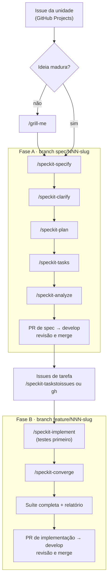
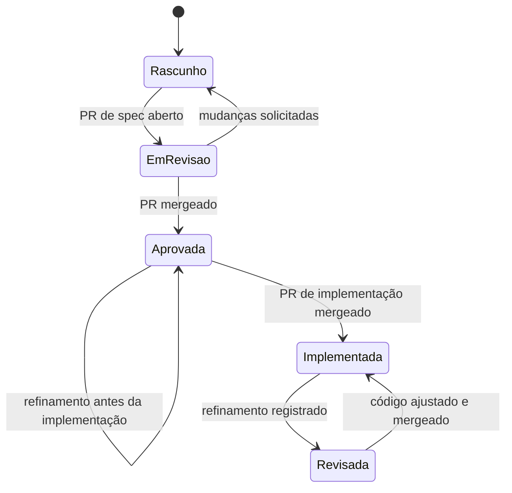
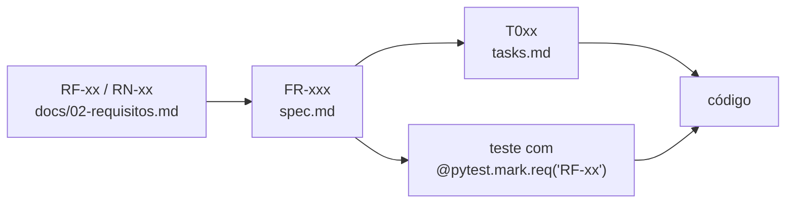

# 05 — Processo SDD (Specification-Driven Development)

> **Status:** Aprovado · **Versão:** 1.1.0 · **Última revisão:** 2026-09-13
> Ferramenta: **GitHub Spec Kit 1.0.6** integrado ao **Claude Code** ([ADR-0004](adr/0004-sdd-com-github-spec-kit.md)).

## 1. Princípio

**A especificação é a fonte da verdade; o código é consequência dela.** Nenhum comportamento entra no sistema sem estar descrito em uma spec aprovada, e nenhuma divergência entre spec e código é corrigida "só no código".

## 2. Hierarquia de artefatos

Em caso de conflito, **o artefato de nível mais alto prevalece** e o de nível mais baixo deve ser corrigido.

| Nível | Artefato | Responde |
|:-----:|----------|----------|
| 1 | [`.specify/memory/constitution.md`](../.specify/memory/constitution.md) | Quais princípios são inegociáveis? |
| 2 | [`docs/`](README.md) — visão, requisitos, arquitetura, segurança, ADRs | O que é o produto e quais decisões valem para todo o projeto? |
| 3 | `specs/NNN-unidade/spec.md` | **O quê** e **por quê** desta unidade (histórias, cenários, FRs, casos de borda). |
| 4 | `specs/NNN-unidade/plan.md` + `research.md`, `data-model.md`, `contracts/`, `quickstart.md` | **Como** esta unidade será construída. |
| 5 | `specs/NNN-unidade/tasks.md` | Em quais passos executáveis e ordenados. |
| 6 | Testes → código | A prova e a implementação. |

## 3. Ciclo de vida de uma unidade

Cada unidade do [roadmap](09-roadmap.md) passa por **duas fases, cada uma com seu próprio PR**.



### Fase A — Especificação

1. Mover a issue da unidade para **Em andamento** e criar a branch `spec/NNN-slug` a partir de `develop`.
2. *(Opcional)* Rodar `/grill-me` se ainda houver decisões em aberto; registrar o resultado em [`docs/sessoes/`](sessoes/).
3. `/speckit-specify <descrição da unidade>` — gera `specs/NNN-slug/spec.md` a partir do [template personalizado](../.specify/templates/overrides/spec-template.md). Cada `FR-xxx` deve citar os `RF-xx`/`RNF-xx`/`RN-xx` de [02-requisitos.md](02-requisitos.md) que detalha.
4. `/speckit-clarify` — elimina todos os marcadores `[NEEDS CLARIFICATION]`.
5. `/speckit-plan <diretrizes técnicas>` — gera plano, pesquisa, modelo de dados, contratos e quickstart. O **Constitution Check** do plano precisa passar.
6. *(Opcional)* `/speckit-checklist` — checklist de qualidade dos requisitos.
7. `/speckit-tasks` — gera `tasks.md`, com testes antes da implementação.
8. `/speckit-analyze` — análise de consistência entre spec, plano e tarefas; achados **críticos** devem ser resolvidos.
9. Mudar o status da spec para `Em revisão` e abrir o **PR de spec** para `develop`. Antes do merge, o status passa a `Aprovada` e a [matriz de rastreabilidade](02-requisitos.md#4-matriz-de-rastreabilidade) é atualizada no mesmo PR.

### Fase B — Implementação

10. Publicar as tarefas como issues vinculadas ao milestone do incremento:
    - com `/speckit-taskstoissues`, que **exige o servidor MCP do GitHub** configurado no Claude Code (a skill usa as ferramentas `list_issues` e de criação de issue desse servidor);
    - sem o servidor MCP, com `gh issue create`, uma issue por tarefa, título `T0xx: <descrição>` e labels `tipo:tarefa` e `unidade:NNN`.
11. Criar a branch `feature/NNN-slug` a partir de `develop`.
12. `/speckit-implement` em **TDD**: testes de aceitação e de borda primeiro (vermelho) → implementação mínima (verde) → refatoração.
13. `/speckit-converge` — confirma que o código cobre spec, plano e tarefas; o que faltar vira nova tarefa.
14. Rodar a suíte completa, gerar o relatório de execução ([07-estrategia-de-testes.md](07-estrategia-de-testes.md#6-relatórios-e-evidências)) e abrir o **PR de implementação**, que também muda o status da spec para `Implementada`.

## 4. Status de uma spec



O campo **Status** do template personalizado usa estes valores em pt-BR: `Rascunho`, `Em revisão`, `Aprovada`, `Implementada`, `Revisada`.

- Um refinamento **antes** da implementação mantém a spec `Aprovada` e só incrementa a versão.
- `Revisada` indica uma spec alterada **depois** de implementada, cujo código ainda precisa ser ajustado.

## 5. Refinamento por feedback

Specs evoluem. O que não pode acontecer é evoluírem **silenciosamente**.

**Gatilhos:** um teste revela ambiguidade ou contradição; a revisão de um PR aponta lacuna; a implementação mostra que algo é inviável; `/speckit-analyze` ou `/speckit-converge` encontram divergência; um bug expõe um caso não especificado; uma auditoria da documentação encontra inconsistência.

**Procedimento:**

1. Abrir issue com o template **Mudança de especificação** (label `spec-change`).
2. Na branch de trabalho, alterar **primeiro o artefato de nível mais alto afetado** (docs → spec → plan → tasks).
3. Registrar a mudança na seção **Histórico de revisões** do artefato e incrementar a versão:
   - **MAJOR** — contrato incompatível (endpoint, campo ou código de erro muda);
   - **MINOR** — novo requisito, cenário ou caso de borda;
   - **PATCH** — esclarecimento sem mudança de comportamento.
4. Adicionar uma linha em [registro-de-refinamentos.md](registro-de-refinamentos.md).
5. Criar ou ajustar o teste que reproduz o feedback; **só então** alterar o código.
6. Abrir o PR com a label `spec-change`, referenciando a issue.

Formato da seção, já presente no template personalizado de spec e nos documentos de projeto:

```markdown
## Histórico de revisões

| Versão | Data       | Mudança                                   | Motivo                                          | Origem        |
|--------|------------|-------------------------------------------|-------------------------------------------------|---------------|
| 1.0.0  | AAAA-MM-DD | Versão aprovada                           | —                                               | PR #N         |
| 1.1.0  | AAAA-MM-DD | Novo caso de borda: busca com termo vazio | Teste de borda revelou comportamento indefinido | Teste · PR #M |
```

## 6. Rastreabilidade



- Todo `FR-xxx` de uma spec cita ao menos um `RF-xx`, `RNF-xx` ou `RN-xx`.
- Todo teste de aceitação ou de borda recebe `@pytest.mark.req(...)` com os IDs que verifica.
- O harness gera `reports/rastreabilidade.md` (requisito → testes), usado para atualizar a matriz em [02-requisitos.md](02-requisitos.md#4-matriz-de-rastreabilidade).

## 7. Definições de Pronto e de Concluído

**Spec pronta para implementar (DoR):**

- [ ] Nenhum `[NEEDS CLARIFICATION]` restante.
- [ ] Cada história tem prioridade, teste independente e cenários *Given/When/Then*.
- [ ] Casos de borda listados, incluindo os do [catálogo](07-estrategia-de-testes.md#4-catálogo-inicial-de-casos-de-borda) aplicáveis.
- [ ] Todo `FR-xxx` rastreia para `RF`/`RNF`/`RN`.
- [ ] Plano passou no Constitution Check; contratos definidos em `contracts/`.
- [ ] `tasks.md` gerado; `/speckit-analyze` sem achados críticos.
- [ ] PR de spec revisado e mergeado.

**Unidade concluída (DoD):**

- [ ] Todos os cenários de aceitação e casos de borda automatizados e passando.
- [ ] Cobertura de linhas e ramificações ≥ 85% e `ruff` sem erros; CI verde.
- [ ] Nenhuma divergência pendente entre spec e código (`/speckit-converge`).
- [ ] README, docs, ADRs e matriz de rastreabilidade atualizados.
- [ ] Relatório de execução publicado em [`docs/relatorios/`](relatorios/).
- [ ] PR de implementação revisado e mergeado.

## 8. Convenções de uso do Spec Kit neste repositório

| Convenção | Detalhe |
|-----------|---------|
| Numeração | Sequencial (`feature_numbering: sequential`). O `NNN` da spec **é o número da unidade** no roadmap; por isso, as specs são criadas na ordem das unidades. |
| Branches | A extensão `git` do Spec Kit **não** está instalada; as branches `spec/NNN-slug` e `feature/NNN-slug` são criadas manualmente, seguindo [06-governanca.md](06-governanca.md). O Spec Kit localiza a feature atual por `.specify/feature.json` (local, ignorado pelo Git), não pelo nome da branch. |
| Idioma | Os títulos de seção dos templates permanecem em **inglês**, para manter a correspondência com os templates e comandos do Spec Kit; todo o conteúdo é escrito em **pt-BR**. |
| Scripts | Variante **Python** (`.specify/scripts/python/`), portável entre Windows, Linux e CI. |
| Arquivos gerados | Não editar à mão `.specify/scripts/`, `.specify/templates/*.md` nem `.claude/skills/speckit-*`. Atualizações seguem [08-ambiente-e-agentes.md](08-ambiente-e-agentes.md#55-atualização-das-ferramentas). |
| Templates personalizados | Ficam em `.specify/templates/overrides/`, que o Spec Kit consulta **antes** dos templates padrão e que não faz parte dos arquivos gerados. O override [`spec-template.md`](../.specify/templates/overrides/spec-template.md) acrescenta **Versão**, status inicial `Rascunho`, citação obrigatória dos IDs de projeto nos `FR-xxx` e a seção *Histórico de revisões*. |
| Integração com GitHub | `/speckit-taskstoissues` depende do servidor MCP do GitHub; a alternativa com `gh` está no passo 10. |

## 9. Histórico de revisões

| Versão | Data | Mudança | Origem |
|--------|------|---------|--------|
| 1.0.0 | 2026-09-13 | Versão inicial. | PR #1 |
| 1.1.0 | 2026-09-13 | Template personalizado de spec (override); dependência do servidor MCP do GitHub em `/speckit-taskstoissues`, com alternativa `gh`; refinamento antes da implementação no diagrama de status; momento das mudanças de status; cobertura de linhas e ramificações. | Auditoria da documentação (R-016 a R-018) |
