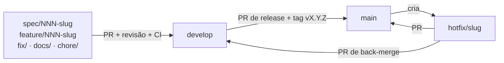

# 06 — Governança do Repositório

> **Status:** Aprovado · **Versão:** 1.0.2 · **Última revisão:** 2026-09-13
> Decisões relacionadas: [ADR-0011](adr/0011-fluxo-git.md) (fluxo Git) e [ADR-0012](adr/0012-revisao-de-codigo-em-projeto-individual.md) (revisão de código).

## 1. Branches



| Branch | Criada a partir de | PR para | Uso |
|--------|--------------------|---------|-----|
| `main` | — | — | Versões liberadas. Recebe apenas PRs de release (de `develop`) e de hotfix. Todo merge gera tag `vX.Y.Z`. |
| `develop` | `main` | `main` | Integração. Recebe PRs das branches de trabalho. |
| `spec/NNN-slug` | `develop` | `develop` | Fase A de uma unidade: spec, plano e tarefas ([05-processo-sdd.md](05-processo-sdd.md)). |
| `feature/NNN-slug` | `develop` | `develop` | Fase B de uma unidade: testes e implementação. |
| `fix/slug` | `develop` | `develop` | Correção de bug. |
| `docs/slug` | `develop` | `develop` | Documentação. |
| `chore/slug` | `develop` | `develop` | Configuração, dependências, CI, ferramentas. |
| `hotfix/slug` | `main` | `main` e `develop` | Correção urgente em versão liberada. |

**Regras:**

- **É proibido fazer commit direto em `main` e `develop`.** A única exceção foi o commit inicial do repositório, necessário para criar as branches.
- Slugs em *kebab-case*, sem acentos (ex.: `feature/003-cofre-de-credenciais`).
- A branch é apagada após o merge.

## 2. Commits — Conventional Commits

```text
<tipo>(<escopo opcional>): <descrição em pt-BR, verbo no presente, minúscula, sem ponto final>

<corpo opcional: o porquê da mudança>

<rodapé opcional: Closes #N · BREAKING CHANGE: ... · Co-Authored-By: ...>
```

| Tipo | Uso |
|------|-----|
| `feat` | Nova funcionalidade |
| `fix` | Correção de bug |
| `docs` | Documentação, specs, ADRs |
| `test` | Testes e harness |
| `refactor` | Mudança interna sem alterar comportamento |
| `chore` | Manutenção, configuração, dependências |
| `ci` | Pipelines do GitHub Actions |
| `build` | Docker, empacotamento |
| `perf` | Desempenho |

**Escopos sugeridos:** número da unidade (`002`), camada (`crypto`, `api`, `services`, `repositories`) ou área (`spec`, `adr`, `harness`).

**Exemplos:**

```text
docs(spec): adiciona spec da unidade 003 cofre de credenciais
test(crypto): cobre adulteração de ciphertext com AAD divergente
feat(002): implementa login com bloqueio após falhas consecutivas
```

Commits produzidos com apoio do Claude Code incluem o rodapé `Co-Authored-By: Claude <noreply@anthropic.com>`, com o modelo usado.

## 3. Pull Requests

- Todo PR sai de uma branch de trabalho e segue para `develop`. Releases e hotfixes seguem para `main`.
- **Título** no formato Conventional Commits. **Descrição** pelo [template](../.github/pull_request_template.md).
- Vincular a issue (`Closes #N`) e o milestone do incremento, quando existirem.
- PRs pequenos e focados: uma fase de uma unidade por PR.
- **Estratégia de merge: merge commit** (`gh pr merge --merge --delete-branch`), que preserva os commits e o histórico da revisão. Sem *squash* e sem *rebase* em `develop`/`main`.

**Condições para merge:**

1. Checklist do template completo.
2. CI verde (a partir do incremento 1).
3. Revisão concluída conforme a seção 4, com todos os comentários respondidos.
4. Nenhuma conversa pendente no PR.

**Release:** PR `develop → main` intitulado `release: vX.Y.Z`, com as notas da versão. Após o merge: tag `vX.Y.Z` e GitHub Release. Correções só de documentação entre incrementos geram versão *patch* (ex.: `v0.1.1`).

## 4. Revisão de código em projeto individual

O projeto tem um único mantenedor, e o GitHub não permite aprovar o próprio PR. Para manter revisão real e rastreável ([ADR-0012](adr/0012-revisao-de-codigo-em-projeto-individual.md)):

| Etapa | Quem | Registro no PR |
|-------|------|----------------|
| 1. Autorrevisão | Autor | Checklist do template marcado. |
| 2. Revisão assistida por IA | Claude Code: `/code-review` em PRs de código (com `--comment`, publica os achados como comentários de linha); revisão dirigida em PRs de documentação; `/security-review` quando o PR toca `crypto`, autenticação ou sessões | Comentários de revisão no PR. |
| 3. Tratamento | Autor | Cada comentário é **corrigido** (com o commit referenciado na resposta) ou **justificado**. |
| 4. Merge | Autor | Somente com todos os comentários tratados e as conversas resolvidas. |

> Se outra pessoa entrar no projeto, a proteção de branch passa a exigir **1 aprovação humana**, e a revisão por IA continua como etapa complementar.

## 5. Issues e GitHub Projects

**Board "Cofre"** *(criado no início do incremento 1)*: `Backlog` → `Pronto` → `Em andamento` → `Em revisão` → `Concluído`.

**Templates de issue** ([`.github/ISSUE_TEMPLATE/`](../.github/ISSUE_TEMPLATE/)):

| Template | Uso |
|----------|-----|
| Unidade | Épico de uma unidade do roadmap: requisitos cobertos, fases, critérios de conclusão. |
| Tarefa | Tarefa independente de `tasks.md`, criada por `/speckit-taskstoissues` (requer o servidor MCP do GitHub) ou por `gh issue create`. |
| Bug | Comportamento divergente da spec. |
| Mudança de especificação | Refinamento por feedback ([05-processo-sdd.md](05-processo-sdd.md#5-refinamento-por-feedback)). |

**Labels** (já criadas no repositório): `tipo:unidade`, `tipo:spec`, `tipo:tarefa`, `tipo:bug`, `tipo:docs`, `tipo:infra`, `spec-change`, `prioridade:must`, `prioridade:should`, `prioridade:could`, `unidade:001` … `unidade:005`.

**Milestones = incrementos** do [roadmap](09-roadmap.md). Cada milestone delimita o escopo de uma iteração (sprint sem data fixa). Os milestones "Incremento 1 — Fundação" a "Incremento 5 — Saúde do cofre e fechamento" já existem no repositório.

**Decomposição:** issue de Unidade → PR de spec → issues de Tarefa (uma por tarefa independente) → PR(s) de implementação que as fecham.

## 6. Proteção de branches

Configuração-alvo para `main` e `develop`:

| Regra | Valor |
|-------|-------|
| Exigir PR antes do merge | Sim |
| Aprovações exigidas | 0 enquanto o projeto for individual; 1 com colaboradores |
| Exigir *status checks* (CI) | Sim, a partir do incremento 1 |
| Exigir resolução de conversas | Sim |
| Bloquear *force push* e exclusão | Sim |
| Aplicar as regras também a administradores | Sim |

**Situação atual** (aplicada via `gh api` no início do incremento 1):

| Regra | `main` | `develop` |
|-------|:------:|:---------:|
| Exigir PR antes do merge, com 0 aprovações | ✅ | ✅ |
| Exigir resolução de conversas | ✅ | ✅ |
| Bloquear *force push* e exclusão | ✅ | ✅ |
| Regras valem também para administradores (`enforce_admins`) | ✅ | ✅ |
| Exigir *status checks* (CI) | Pendente | Pendente |

Os *status checks* (jobs `lint`, `test` e `docker`, [07-estrategia-de-testes.md §7](07-estrategia-de-testes.md#7-integração-contínua)) entram na proteção logo depois do merge do PR que criar o workflow de CI (Fase B da unidade 001). Exigir antes disso um check que ainda não existe deixaria todo PR bloqueado, à espera de um status que nunca chega.

## 7. Versionamento

[SemVer](https://semver.org/lang/pt-BR/). Durante o MVP a versão fica em `0.x`; cada incremento concluído incrementa o *minor* (ver [09-roadmap.md](09-roadmap.md)) e correções entre incrementos incrementam o *patch*. `v1.0.0` marca todos os requisitos *Must* implementados.

## 8. Histórico de revisões

| Versão | Data | Mudança | Origem |
|--------|------|---------|--------|
| 1.0.0 | 2026-09-13 | Versão inicial. | PR #1 |
| 1.0.1 | 2026-09-13 | Situação do board e das labels; alternativa `gh` para issues de tarefa; versão *patch* para correções entre incrementos; resolução de conversas antes do merge. | Auditoria da documentação |
| 1.0.2 | 2026-09-13 | Proteção de `main` e `develop` aplicada (sem *status checks* até existir CI); milestones criados. | Início do incremento 1 |
