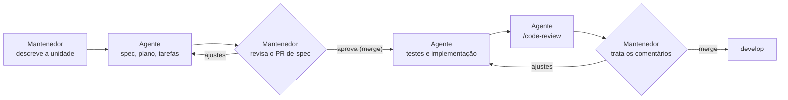

# 08 — Ambiente de Desenvolvimento e Agentes de IA

> **Status:** Aprovado · **Versão:** 1.0.0 · **Última revisão:** 2026-09-13
> Decisões relacionadas: [ADR-0003](adr/0003-claude-code-como-agente-unico.md), [ADR-0004](adr/0004-sdd-com-github-spec-kit.md), [ADR-0006](adr/0006-python-fastapi-uv.md), [ADR-0014](adr/0014-ambiente-reprodutivel-com-docker.md).

## 1. Pré-requisitos

| Ferramenta | Versão | Para quê |
|------------|--------|----------|
| Git | 2.40+ | Versionamento |
| Docker + Docker Compose v2 | 24+ | Ambiente reprodutível (caminho recomendado) |
| Python | 3.13 | Execução local sem Docker |
| [uv](https://docs.astral.sh/uv/) | 0.12+ | Dependências e ambiente virtual |
| [GitHub CLI](https://cli.github.com/) (`gh`) | 2.x | PRs, issues e projects pelo terminal |
| [Claude Code](https://docs.anthropic.com/en/docs/claude-code/setup) | atual | Agente de IA do projeto |
| [Specify CLI](https://github.com/github/spec-kit) (Spec Kit) | **1.0.6** | Fluxo SDD |

```bash
# uv (alternativas em https://docs.astral.sh/uv/getting-started/installation/)
pip install uv

# Spec Kit, com versão fixada
uv tool install specify-cli --from git+https://github.com/github/spec-kit.git@v1.0.6
specify version
```

## 2. Arquivos de padronização do ambiente

| Arquivo | Finalidade | Situação |
|---------|------------|----------|
| `.gitattributes` | Normaliza fins de linha (LF) entre Windows e Linux | Existe |
| `.gitignore` | Ignora ambientes, caches, relatórios locais, bancos e segredos | Existe |
| `pyproject.toml` | Metadados, dependências e configuração de `ruff`, `pytest` e `coverage` | Incremento 1 |
| `uv.lock` | Versões exatas das dependências | Incremento 1 |
| `Dockerfile` | Imagem multi-stage `python:3.13-slim`, usuário não-root, `uv sync --frozen` | Incremento 1 |
| `docker-compose.yml` | Serviço `api` (porta 8000, volume `cofre-data`) e serviço `tests` (roda a suíte e grava `reports/`) | Incremento 1 |
| `.env.example` | Variáveis de ambiente documentadas | Incremento 1 |
| `.github/workflows/ci.yml` | Lint, testes e build no GitHub Actions | Incremento 1 |

## 3. Variáveis de ambiente

| Variável | Padrão | Descrição |
|----------|--------|-----------|
| `COFRE_ENV` | `production` | `production`, `development` ou `test`. Parâmetros criptográficos reduzidos só em `test`. |
| `COFRE_DATABASE_URL` | `sqlite:////data/cofre.db` | URL do banco (SQLAlchemy). |
| `COFRE_SESSION_TTL_MINUTES` | `30` | Validade da sessão (RN-05). |
| `COFRE_LOGIN_MAX_ATTEMPTS` | `5` | Falhas antes do bloqueio (RN-14). |
| `COFRE_LOGIN_LOCK_MINUTES` | `15` | Duração do bloqueio (RN-14). |
| `COFRE_MAX_CREDENTIALS_PER_USER` | `1000` | Limite do cofre (RN-07). |
| `COFRE_ARGON2_MEMORY_KIB` | `19456` | Memória do Argon2id (mínimo fora de `test`). |
| `COFRE_ARGON2_TIME_COST` | `2` | Iterações do Argon2id. |
| `COFRE_ARGON2_PARALLELISM` | `1` | Paralelismo do Argon2id. |
| `COFRE_LOG_LEVEL` | `INFO` | Nível de log. |

## 4. Execução

Disponível a partir do incremento 1:

```bash
# Com Docker (recomendado)
docker compose up --build            # API em http://localhost:8000 · Swagger em /docs
docker compose run --rm tests        # suíte completa; relatórios em ./reports

# Sem Docker
uv sync
uv run uvicorn cofre.main:app --reload
uv run pytest
```

## 5. Claude Code: configuração do agente

O projeto usa **somente o Claude Code** como agente de IA ([ADR-0003](adr/0003-claude-code-como-agente-unico.md)).

### 5.1 Arquivos de instrução e contexto

| Caminho | Conteúdo | Origem |
|---------|----------|--------|
| [`CLAUDE.md`](../CLAUDE.md) | Regras do projeto, fontes da verdade, fluxo SDD, convenções e limites do agente. Carregado automaticamente em toda sessão. | Escrito para o projeto |
| [`.specify/memory/constitution.md`](../.specify/memory/constitution.md) | Princípios inegociáveis, verificados pelo *Constitution Check* de cada plano | Escrito para o projeto |
| `.claude/skills/speckit-*/` | 10 skills do fluxo SDD | Gerado por `specify init --here --integration claude --script py` (Spec Kit 1.0.6) |
| `.claude/skills/grill-me/` e `.claude/skills/grilling/` | Entrevista estruturada para amadurecer ideias antes de especificar | [mattpocock/skills](https://github.com/mattpocock/skills) @ `3cca18b` (MIT) |
| `.specify/templates/` | Templates de spec, plano, tarefas, checklist e constituição | Spec Kit |
| `.specify/scripts/python/` | Scripts chamados pelas skills (criação de feature, setup de plano e tarefas) | Spec Kit |
| `.claude/settings.local.json` | Preferências pessoais de permissão | Local (ignorado pelo Git) |

### 5.2 Skills e quando usar

| Skill | Momento | Resultado |
|-------|---------|-----------|
| `/grill-me` | Ideia vaga ou decisão arriscada, antes de especificar | Entendimento compartilhado, registrado em [`docs/sessoes/`](sessoes/) |
| `/speckit-constitution` | Mudança de princípios do projeto | `constitution.md` atualizada |
| `/speckit-specify` | Fase A | `specs/NNN-slug/spec.md` |
| `/speckit-clarify` | Fase A | Spec sem ambiguidades |
| `/speckit-plan` | Fase A | `plan.md`, `research.md`, `data-model.md`, `contracts/`, `quickstart.md` |
| `/speckit-checklist` | Fase A (opcional) | Checklist de qualidade dos requisitos |
| `/speckit-tasks` | Fase A | `tasks.md` |
| `/speckit-analyze` | Fase A | Relatório de consistência entre artefatos |
| `/speckit-taskstoissues` | Após o merge do PR de spec | Issues de tarefa no GitHub |
| `/speckit-implement` | Fase B | Testes e código |
| `/speckit-converge` | Fase B | Tarefas restantes anexadas a `tasks.md` |
| `/code-review` | Revisão de PR | Achados publicados como comentários |
| `/security-review` | PRs que tocam `crypto`, autenticação ou sessões | Revisão de segurança |

### 5.3 Orquestração e pontos de controle humano



- O agente **não implementa** nada sem spec aprovada e **não altera comportamento** sem antes atualizar a spec (regras em [`CLAUDE.md`](../CLAUDE.md)).
- Decisões arquiteturais tomadas durante uma sessão viram **ADR** no mesmo PR.
- Sessões com decisões relevantes são resumidas em [`docs/sessoes/`](sessoes/).
- Commits com apoio do agente levam o rodapé `Co-Authored-By`.

### 5.4 Prompts de referência

```text
/speckit-specify Unidade 003 — Cofre de credenciais. Detalhe RF-08 a RF-13 e as regras RN-06 a RN-09, RN-13 e RN-15 de docs/02-requisitos.md, respeitando docs/04-seguranca.md. Inclua os casos de borda da unidade 003 listados em docs/07-estrategia-de-testes.md.

/speckit-plan Siga docs/03-arquitetura.md: Python 3.13, FastAPI, SQLAlchemy 2 com SQLite, camadas api/services/crypto/repositories. Contratos em contracts/openapi.yaml usando o formato de erro padronizado.
```

### 5.5 Atualização das ferramentas

| Ferramenta | Como atualizar |
|------------|----------------|
| Spec Kit | `specify self check` → `specify self upgrade --tag vX.Y.Z` → `specify init --here --force --integration claude --script py`. A mudança vai em PR `chore/atualiza-spec-kit`; revisar o diff dos arquivos gerados e atualizar a versão citada nos docs. |
| Skills do mattpocock | Copiar novamente de `skills/productivity/{grill-me,grilling}` e registrar o novo commit nesta página. |
