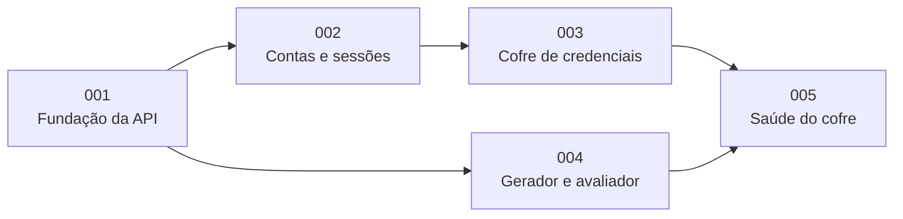

# 09 — Roadmap e Decomposição em Unidades

> **Status:** Aprovado · **Versão:** 1.0.0 · **Última revisão:** 2026-09-13
> Desenvolvimento incremental **sem datas fixas**. Cada incremento é um milestone no GitHub e funciona como uma iteração (sprint).

## 1. Incrementos

| # | Incremento | Versão | Entregas | Critério de conclusão |
|---|------------|--------|----------|-----------------------|
| 0 | **Documentação e governança** | `v0.1.0` | `docs/`, ADRs, `CLAUDE.md`, `README.md`, constituição, Spec Kit, skills, templates do GitHub | PR mergeado em `develop` e release em `main`. |
| 1 | **Fundação** | `v0.2.0` | Spec 001; esqueleto `src/cofre`; configuração; erros padronizados; persistência; `/health`; harness de testes; Docker; CI | RF-01 atendido; `docker compose up` e `docker compose run --rm tests` verdes; CI ativo; proteção de branches aplicada. |
| 2 | **Contas e sessões** | `v0.3.0` | Spec 002 + implementação | RF-02 a RF-07 atendidos conforme prioridade. |
| 3 | **Cofre de credenciais** | `v0.4.0` | Spec 003 + implementação | RF-08 a RF-13 atendidos. |
| 4 | **Gerador e avaliador de senhas** | `v0.5.0` | Spec 004 + implementação | RF-14 e RF-15 atendidos. |
| 5 | **Saúde do cofre e fechamento** | `v1.0.0` | Spec 005 + implementação; relatório final de testes | RF-16 atendido; todos os *Must* implementados; relatório final publicado. |

## 2. Decomposição em unidades

Cada unidade é **uma spec do Spec Kit**, desenvolvida, testada e entregue de forma independente.

| Unidade | Spec | Requisitos | Componentes | Depende de | Teste isolado |
|---------|------|------------|-------------|------------|---------------|
| **001** Fundação da API | `specs/001-fundacao-da-api` | RF-01, RNF-08, RNF-09, RNF-10, RNF-11, RNF-13 | `core` (config, clock, erros, logging), `api` (app, handlers, health), `repositories/database` | — | `GET /health` e autoverificação do harness |
| **002** Contas e sessões | `specs/002-contas-e-sessoes` | RF-02 a RF-07; RN-01 a RN-05, RN-12, RN-14; RNF-02, RNF-04 a RNF-07 | `crypto` (hashing, kdf, cipher, keys, tokens), `AccountService`, `SessionService`, `UserRepository`, `SessionRepository`, routers `accounts` e `sessions` | 001 | Cadastro → login → `/me` → logout, com relógio controlado |
| **003** Cofre de credenciais | `specs/003-cofre-de-credenciais` | RF-08 a RF-13; RN-06 a RN-09, RN-13, RN-15; RNF-01, RNF-03, RNF-12 | `VaultService`, `CredentialRepository`, router `credentials` | 001, 002 | CRUD com usuário autenticado via fixture `auth_client` |
| **004** Gerador e avaliador | `specs/004-gerador-de-senhas` | RF-14, RF-15; RN-10, RN-11 | `PasswordGenerator`, `StrengthEstimator`, router `passwords` | 001 | Funções puras e endpoints públicos |
| **005** Saúde do cofre | `specs/005-saude-do-cofre` | RF-16; RN-11 | `VaultHealthService`, router `vault` | 003, 004 | Relatório sobre um cofre de teste com senhas fracas e repetidas |

A unidade 004 não depende de 002 nem de 003 e pode ser implementada em paralelo. As **specs**, porém, são criadas em ordem numérica, porque o Spec Kit numera sequencialmente ([05-processo-sdd.md](05-processo-sdd.md#8-convenções-de-uso-do-spec-kit-neste-repositório)).

## 3. Situação

| Incremento | Situação |
|------------|----------|
| 0 — Documentação e governança | Em andamento |
| 1 a 5 | Planejado |
