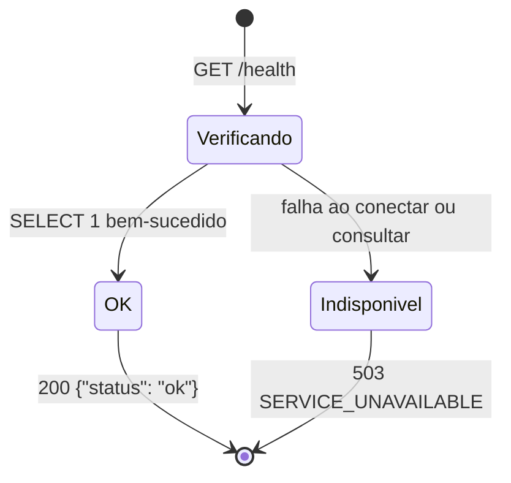

# Data Model: Fundação da API

**Spec**: [spec.md](spec.md) · **Plano**: [plan.md](plan.md) · **Data**: 2026-09-13

A unidade 001 **não cria tabelas**. `Base.metadata` existe vazia e é preenchida pelas unidades 002 e 003 conforme docs/03 §3. Este documento descreve as estruturas de configuração, contrato e evidência que a unidade introduz.

## Settings

Configuração imutável, lida de variáveis com prefixo `COFRE_` (docs/08 §3). Qualquer violação impede a inicialização com `ConfigurationError`, cuja mensagem cita a variável e o motivo, **nunca o valor** (FR-019).

| Campo | Variável | Tipo | Padrão | Validação |
|-------|----------|------|--------|-----------|
| `env` | `COFRE_ENV` | `"production"` \| `"development"` \| `"test"` | `production` | Valor fora da lista → erro. |
| `database_url` | `COFRE_DATABASE_URL` | texto | `sqlite:///./data/cofre.db` | *Backend* `sqlite` (princípio V); outro → erro. |
| `session_ttl_minutes` | `COFRE_SESSION_TTL_MINUTES` | inteiro | `30` | ≥ 1 |
| `login_max_attempts` | `COFRE_LOGIN_MAX_ATTEMPTS` | inteiro | `5` | ≥ 1 |
| `login_lock_minutes` | `COFRE_LOGIN_LOCK_MINUTES` | inteiro | `15` | ≥ 1 |
| `max_credentials_per_user` | `COFRE_MAX_CREDENTIALS_PER_USER` | inteiro | `1000` | ≥ 1 |
| `argon2_memory_kib` | `COFRE_ARGON2_MEMORY_KIB` | inteiro | `19456` | ≥ 1; fora de `test`, ≥ 19.456 (FR-020) |
| `argon2_time_cost` | `COFRE_ARGON2_TIME_COST` | inteiro | `2` | ≥ 1; fora de `test`, ≥ 2 (FR-020) |
| `argon2_parallelism` | `COFRE_ARGON2_PARALLELISM` | inteiro | `1` | ≥ 1 (o mínimo OWASP coincide com o mínimo absoluto) |
| `log_level` | `COFRE_LOG_LEVEL` | `DEBUG` \| `INFO` \| `WARNING` \| `ERROR` \| `CRITICAL` | `INFO` | Sem diferenciar maiúsculas; normalizado em maiúsculas. |

**Exemplo de mensagem:** `Configuração inválida: COFRE_ARGON2_MEMORY_KIB abaixo do mínimo permitido fora de COFRE_ENV=test.`

## Clock

| Implementação | Onde | Comportamento |
|---------------|------|---------------|
| `Clock` | `cofre.core.clock` | Protocolo: `now() -> datetime` com `tzinfo=UTC`. |
| `SystemClock` | `cofre.core.clock` | `datetime.now(UTC)`. Padrão quando `create_app` recebe `clock=None`. |
| `FakeClock` | `tests/support/clock.py` | Instante inicial fixo (`2026-01-01T00:00:00Z` por padrão); `advance(**timedelta_kwargs)`; `set(instant)` rejeita `datetime` sem fuso. |

## Resposta de erro

Formato de docs/03 §6.3, formalizado em [contracts/openapi.yaml](contracts/openapi.yaml#/components/schemas/ErrorResponse).

```json
{
  "error": {
    "code": "VALIDATION_ERROR",
    "message": "Os dados enviados são inválidos.",
    "details": [{ "field": "body", "issue": "JSON malformado." }]
  }
}
```

| Campo | Regra |
|-------|-------|
| `error.code` | Um dos códigos de docs/03 §6.3. |
| `error.message` | Texto fixo em pt-BR por código; nunca contém valores da requisição. |
| `error.details` | Obrigatório e não vazio **somente** quando `code` = `VALIDATION_ERROR`; ausente nos demais. |
| `details[].field` | Localização do campo (R5 de research.md); `body` para JSON malformado. |
| `details[].issue` | Texto em pt-BR por tipo de erro; nunca contém o valor recebido. |

### Códigos usados na unidade 001

| HTTP | `code` | `message` |
|------|--------|-----------|
| 404 | `NOT_FOUND` | Recurso não encontrado. |
| 405 | `METHOD_NOT_ALLOWED` | Método não permitido para este recurso. |
| 422 | `VALIDATION_ERROR` | Os dados enviados são inválidos. |
| 500 | `INTERNAL_ERROR` | Erro interno inesperado. |
| 503 | `SERVICE_UNAVAILABLE` | Serviço temporariamente indisponível. |

### Textos de `issue` na unidade 001

| Tipo de erro do Pydantic | `issue` |
|--------------------------|---------|
| `json_invalid` | JSON malformado. |
| `missing` | Campo obrigatório. |
| `*_type`, `*_parsing` | Tipo de valor inválido. |
| demais | Valor inválido. |

## Estado de saúde



Não há estado guardado entre chamadas: cada `GET /health` refaz a verificação (FR-003).

## Contexto de requisição

| Campo | Origem |
|-------|--------|
| `request_id` | `X-Request-ID` válido e único, ou UUID v4 gerado (FR-012). |
| `method` | Método HTTP. |
| `route` | Modelo da rota correspondente (ex.: `/health`, `/api/v1/credentials/{id}`) ou `null`. |
| `status` | Status da resposta enviada. |
| `duration_ms` | Duração medida com relógio monotônico, em milissegundos com até 3 casas. |

**Regra de validação do `X-Request-ID`:** exatamente um cabeçalho e valor que case `^[A-Za-z0-9-]{1,64}$` com caracteres ASCII.

## Registro de log

Uma linha JSON por evento no `stdout`.

**Requisição** (`INFO`, FR-013):

```json
{"timestamp": "2026-01-01T00:00:00Z", "level": "INFO", "event": "request", "request_id": "abc-123", "method": "GET", "route": "/health", "status": 200, "duration_ms": 1.234}
```

**Exceção não tratada** (`ERROR`, FR-015):

```json
{"timestamp": "2026-01-01T00:00:00Z", "level": "ERROR", "event": "unhandled_exception", "request_id": "abc-123", "error_type": "RuntimeError", "stack": ["src/cofre/api/routers/x.py:10:handler"]}
```

**Falha do banco na inicialização** (`ERROR`): `event` = `database_init_failed`, `error_type`.

Campos **proibidos** em qualquer registro: corpo, *query string*, valores de cabeçalhos, mensagem de exceção, valores de `X-Request-ID` rejeitados (FR-014).

## Catálogo de requisitos

Lido de `docs/02-requisitos.md` pelo harness.

| Campo | Regra |
|-------|-------|
| `id` | `RF-\d{2}`, `RNF-\d{2}` ou `RN-\d{2}`, na primeira coluna de uma linha de tabela. |
| `priority` | `Must`, `Should`, `Could` ou `Won't` para RF e RNF; ausente para RN. |

## Relatório de rastreabilidade

Arquivo `reports/rastreabilidade.md`, gerado em toda execução (FR-026):

```markdown
# Rastreabilidade requisito → testes

Execução: 2026-09-20T12:00:00Z · Seleção: padrão · Testes: 42

| Requisito | Prioridade | Testes | Resultado |
|-----------|------------|--------|-----------|
| RF-01 | Must | tests/api/test_health.py::test_health_returns_ok_when_database_is_available | passed |

## Requisitos Must sem teste

- RF-02 — (unidade 002)
```

A seção final é informativa: não altera o código de saída (spec, US3 cenário 6).
